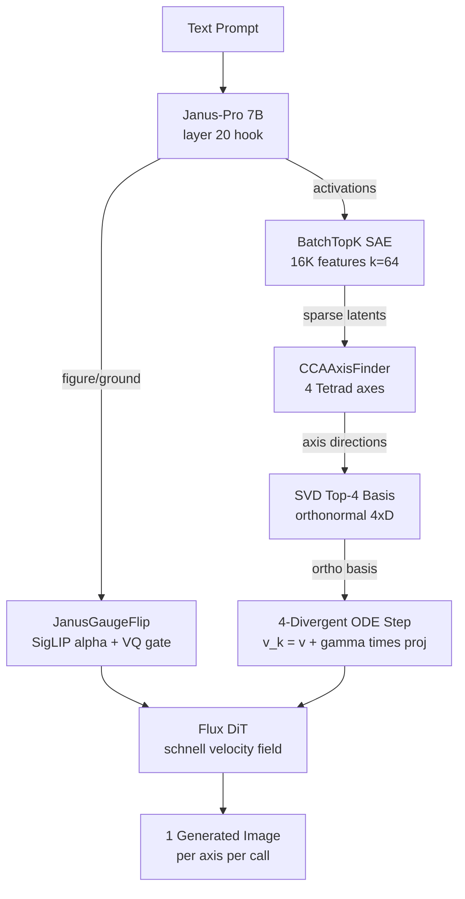

# TetradFlow

[](https://github.com/hinanohart/tetradflow/actions/workflows/ci.yml)
[](https://github.com/hinanohart/tetradflow)
[](LICENSE)
[](https://www.python.org/downloads/)

**McLuhan's Tetrad as inductive bias in Janus-Pro + Flux.**

> **Research prototype — not a validated cognitive model.**
> See [docs/disclaimer.md](docs/disclaimer.md) for scope limitations.

TetradFlow embeds McLuhan's four media laws — Enhance, Obsolesce, Retrieve, Reverse — as an
inductive bias in a multimodal image-generation pipeline. It works by training a Sparse
Autoencoder (SAE) on Janus-Pro layer-20 activations, using CCA to locate the four Tetrad
directions in feature space, then injecting those directions into Flux's velocity field at
sampling time via a 4-divergent ODE step. The intended result is one generated image per
Tetrad axis (four per prompt when all axes are sampled), but this requires calling
`generate()` once per axis; `mode="tetrad"` currently raises `NotImplementedError`
pending the Flux callback wiring (P1 milestone T4). The current release (`v0.0.1.dev0`) supports
CFG-baseline generation end-to-end; Tetrad-steered sampling (`mode="tetrad"`) is implemented
and unit-tested but awaits the Diffusers callback API hook (P1 milestone T4).

---

## Architecture



---

## Key Components

| Component | File | What it does |
|---|---|---|
| **BatchTopK SAE** | `src/tetradflow/sae.py` | Unsupervised feature extraction from Janus-Pro layer 20 (arXiv:2412.06410) |
| **CCAAxisFinder** | `src/tetradflow/cca.py` | Post-hoc identification of 4 Tetrad axes in SAE feature space (P0-2) |
| **SVD top-4 basis** | `src/tetradflow/ode.py` | Order-independent orthogonalisation of Tetrad directions via SVD (P0-3) |
| **4-divergent ODE** | `src/tetradflow/ode.py` | Injects Tetrad axis projections into Flux velocity field |
| **JanusGaugeFlip** | `src/tetradflow/gauge.py` | Figure/Ground blending via SigLIP alpha + VQ (1-alpha) gate |
| **TetradFlowPipeline** | `src/tetradflow/pipeline.py` | Orchestrates all components end-to-end |

---

## Installation

> **Note (v0.0.1.dev0):** PyPI publication is pending (Trusted Publisher not yet configured).
> Install from source until the first PyPI release lands:

```bash
pip install git+https://github.com/hinanohart/tetradflow
```

For development:

```bash
git clone https://github.com/hinanohart/tetradflow
cd tetradflow
pip install -e ".[dev]"
```

---

## Quick Start

> **Status note (v0.0.1.dev0)**: `mode="tetrad"` raises `NotImplementedError`
> until the Flux `callback_on_step_end` wiring lands (P1 milestone T4 — see
> [ROADMAP.md](ROADMAP.md)). Use `mode="cfg_baseline"` for end-to-end generation
> in the current release; the Tetrad-injected sampling path is implemented and
> unit-tested in `src/tetradflow/ode.py::tetrad_step`, but the Flux integration
> hook needs the upcoming Diffusers callback API surface to land.

```python
from tetradflow import TetradFlowPipeline

pipeline = TetradFlowPipeline(
    sae_path="checkpoints/sae.safetensors",
    axes_map_path="checkpoints/axes_map.safetensors",
    vram_mode="bf16",  # BF16: ~52 GB VRAM (A100/H100 recommended)
)
pipeline.load()

# Works today: CFG baseline (no axis steering).
image = pipeline.generate(
    prompt="A city at night",
    mode="cfg_baseline",
)
image.save("output.png")

# Planned (T4): Tetrad-axis steered generation.
# image = pipeline.generate(prompt="A city at night", axis="Enhance", mode="tetrad")

pipeline.unload()
```

---

## How It Works

1. **Feature extraction** — A BatchTopK SAE is trained on Janus-Pro layer-20 residual-stream
   activations. This gives a 16 384-dimensional sparse feature space.

2. **Axis identification** — CCA post-hoc maps McLuhan's four Tetrad labels (from 60 manually
   annotated seed examples) to directions in the SAE feature space. Six pairwise cosine
   similarities must all be below 0.3 before the PoC proceeds (P0-2 gate).

3. **Orthogonalisation** — The four raw direction vectors are orthonormalised via
   `torch.linalg.svd` (truncated top-4). Gram-Schmidt is explicitly forbidden (P0-3) to
   avoid axis-order dependence.

4. **ODE injection** — At each Flux denoising step, the Tetrad projection is added to the
   velocity field: `v_k = v_theta(x,t,c_text) + gamma * <delta, e_k> * e_k` for each of
   the four axes k, producing four latent trajectories.

5. **Figure/Ground gating** — JanusGaugeFlip blends Janus-Pro's SigLIP path (figure) with
   its VQ discrete path (ground) via a learned alpha gate, mitigating figure/ground
   conflation (F4 mitigation).

---

## CLI

```bash
# Train SAE (GPU required)
tetradflow train-sae --output checkpoints/sae.safetensors

# Identify Tetrad axes via CCA (P0-2)
tetradflow identify-axes \
  --sae checkpoints/sae.safetensors \
  --labels eval/rater_a_labels.json \
  --output checkpoints/axes_map.safetensors

# Generate image
tetradflow generate "A city at night" \
  --axis Enhance \
  --sae checkpoints/sae.safetensors \
  --axes-map checkpoints/axes_map.safetensors \
  -o output.png

# Run P0-4 human gate check
tetradflow gate-check --eval-json checkpoints/eval_output.json
```

---

## Evaluation

### P0-2 Orthogonality Gate

After running `identify-axes`, check the 6 pairwise cosine similarities:

```bash
pytest src/tetradflow/eval/direct_metrics.py -v \
  --axes-map checkpoints/axes_map.safetensors
```

All 6 pairs must have |cosine| < 0.3.

### P1-3 ASS vs CFG Baseline

```python
from tetradflow.eval.ass import check_p1_3_gate

result = check_p1_3_gate(
    tetrad_activations=tetrad_z,
    cfg_activations=cfg_z,
    target_axis_idx=0,  # Enhance
    axis_feature_indices=axes_map.feature_indices,
)
print(result)  # gate_pass: True if CI lower > 0
```

### Human Evaluation (P2-1)

```python
from tetradflow.eval.human_eval import generate_forced_choice_csv

generate_forced_choice_csv("eval/forced_choice.csv", n_per_axis=8)
# Fill in the CSV, then:
from tetradflow.eval.human_eval import eval_summary
print(eval_summary("eval/forced_choice.csv"))
# Requires kappa >= 0.7
```

---

## P0 Checklist

Before the 3-month PoC begins, all 4 items must pass:

- [ ] **P0-1**: Seed-60 manual labels with Cohen's kappa >= 0.7 (user + 1 rater, ~1 week)
- [ ] **P0-2**: SAE cosine orthogonality < 0.3 for all 6 axis pairs
- [ ] **P0-3**: No Gram-Schmidt — SVD top-4 only (`grep -r gram_schmidt src/` -> empty)
- [ ] **P0-4**: Human gate enforced — no auto-degradation on CI red

See [docs/p0_checklist.md](docs/p0_checklist.md) for verification commands.

---

## VRAM Requirements

| Mode | Models loaded | VRAM |
|---|---|---|
| BF16 (default) | Janus-Pro 7B + Flux.1-schnell + SAE | ~52 GB (A100/H100 recommended) |
| SAE-only (Plan C) | SAE library standalone | < 2 GB |

> **Note**: FP8 quantization via torchao is a P1 milestone (NOT yet implemented).

---

## HF Spaces Demo

Live demo: HuggingFace Spaces (planned — will appear at `hinanohart/tetradflow`
once the SAE artifact lands; not deployed in the GitHub-only v0.0.1.dev0 milestone).

---

## Roadmap

See [ROADMAP.md](ROADMAP.md).

---

## Security

TetradFlow loads Janus-Pro via HuggingFace Transformers with
`trust_remote_code=True` (required by the model's custom architecture). This
executes arbitrary Python code from the model repository at load time.

**Mitigations for production / shared environments:**

- **Pin a commit SHA**, do not track `main`:
  ```python
  AutoModelForCausalLM.from_pretrained(
      "deepseek-ai/Janus-Pro-7B",
      revision="<exact-commit-sha>",  # not "main"
      trust_remote_code=True,
  )
  ```
- Audit the loaded `modeling_*.py` files before first use (`~/.cache/huggingface/modules/`).
- Run training / inference in a sandboxed user, not as root.
- Do not load arbitrary forks (`tetradflow_*`-prefixed unofficial repos) without review.

The same applies to `scripts/train_sae.py` and `scripts/identify_axes_cca.py`,
which load Janus-Pro the same way.

---

## Citation

```bibtex
@software{tetradflow2026,
  title  = {TetradFlow: McLuhan Tetrad as Inductive Bias in Janus-Pro + Flux},
  year   = {2026},
  url    = {https://github.com/hinanohart/tetradflow},
  note   = {Research prototype. Version 0.0.1.dev0.}
}
```

---

## License

MIT. See [LICENSE](LICENSE).

For dependency attribution required by Apache 2.0 §4(d), see
[THIRD_PARTY_LICENSES.md](THIRD_PARTY_LICENSES.md). Redistributors of binary
or source forms must include upstream LICENSE and NOTICE files for
Apache-2.0-licensed dependencies (transformers, diffusers, huggingface-hub,
safetensors, Flux.1-schnell, gradio, spaces).

Base models:
- Janus-Pro: MIT (DeepSeek AI)
- Flux.1-schnell: Apache 2.0 (Black Forest Labs)
- Show-o: Apache 2.0 (NUS) — *not yet integrated; v1.0 milestone*
- LanguageBind: MIT (PKU) — *not yet integrated; v1.0 milestone*
- SAELens: MIT (optional `[research]` extra only)

---

## Contributing

This is a research PoC. See [ROADMAP.md](ROADMAP.md) for open problems.
Issues and PRs welcome. Please read [docs/p0_checklist.md](docs/p0_checklist.md)
before proposing changes to the SAE or ODE components.
